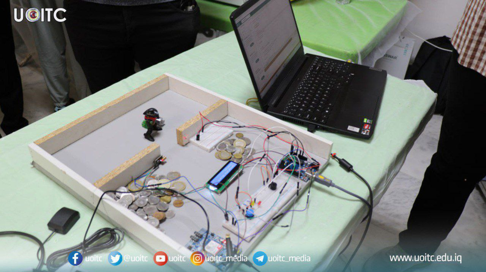

# 🔐 Smart IoT Security Alarm System

This is an **IoT-based Security Alarm System** that detects intrusions using a laser sensor and LDR (Light Dependent Resistor). When an intrusion is detected, it:

- Activates a buzzer
- Flashes LEDs
- Calls a predefined phone number via a **SIM808 GSM module**
- Displays status updates on an **LCD screen**

> ✅ **Built by:** Sohaib Raid Rasheed

---

## 📽️ Demo

🎥 [Watch the Project in Action](media/demo-video.mp4)  
🖼️ 

---

## 📖 Description

This project provides a low-cost yet effective security solution using simple components. It is suitable for use in:

- 🏠 Homes
- 🏪 Shops
- 🧪 Labs
- 📦 Storage rooms

The system continuously monitors for light interruption or changes in brightness, which indicate a possible intrusion.

---

## 🧠 Features

- 🔦 Laser + LDR intrusion detection
- 🔔 Audible buzzer alarm
- 💡 Flashing LEDs as visual alerts
- 📞 SIM808 GSM-based phone call alerts
- 📟 LCD display for system messages
- 🔘 Manual reset button

---

## 🔌 Components Used

| Component        | Quantity | Description                        |
|------------------|----------|------------------------------------|
| Arduino Uno      | 1        | Main microcontroller               |
| SIM808 Module    | 1        | For calling                        |
| LDR Sensor       | 1        | Detects changes in light           |
| Laser Module     | 1        | Intrusion beam                     |
| Buzzer           | 1        | Sounds alarm                       |
| LEDs             | 2        | Alert indicators                   |
| Push Button      | 1        | Resets alarm                       |
| LCD 16x2 I2C     | 1        | Displays system status             |
| Resistors, wires | -        | For circuit connections            |

---

## 🧰 How It Works

1. **Startup** – LCD displays a welcome message.
2. **Monitoring** – LDR and laser beam monitor the environment.
3. **Detection** – When LDR value drops or laser is interrupted:
   - Buzzer activates
   - LEDs flash alternately
   - SIM808 module calls your phone
4. **Reset** – Pressing the button silences the alarm and resets the system.

---

## 🛠️ Setup Instructions

1. Connect all components as shown in the image.
2. Upload the code using Arduino IDE.
3. Insert a valid SIM card into the SIM808 module.
4. Power on the system and test by interrupting the laser beam or reducing light to the LDR.

---

